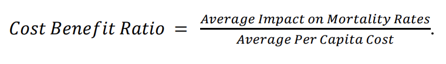

# Actuarial Theory and Practice A @ UNSW

_"Tell me and I forget. Teach me and I remember. Involve me and I learn" - Benjamin Franklin_

---

### View Zoro Consulting's full report [here](Zoro%20Consulting%20Report.pdf).

Any references to appendices or citations can be found there.

---

### Executive Summary

Zoro Consulting has been engaged by SuperLife to develop a health incentive program
aligning with their longer-term life insurance offerings, which will improve its policyholders’
expected mortality after the policyholder has purchased a life insurance program. This report
details the proposed program, a preventative health screening rewards-based program, which
consists of a mobile application to provide individualised recommendations on health
screenings appropriate for each policyholder, and reimbursement for successful completion
of such screenings.

---

### Overview

The proposed program aims to reduce health risks and mortality rates amongst policyholders
through prevention and early detection of health issues such as breast cancer, prostate cancer,
high blood pressure and sexually transmitted diseases, leveraging preventative screening
services available at GP offices. The program is supported by strong evidence that
preventative screening services are associated with lower rates of mortality. For example, a
recent study conducted in the UK found that a similar preventative health screening program
targeting conditions such as heart disease, diabetes, stroke, and others, led to a 23% lower
risk of death from any cause (Attwooll, 2024). This evidence underscores the potential
effectiveness of the proposed program in improving health outcomes and reducing mortality
rates amongst SuperLife’s policyholder pool.

---

### Objectives

#### Main Program Objectives
1. Risk Management
2. Enhanced Value Proposition and Competitive Advantage
3. Long-Term Sustainability
4. Data Collection and Insights

#### Key Metrics to Measure Success
1. Policyholder Utilisation
2. Customer Satisfaction
3. Claims Frequency
4. Lapse Rate
5. New Policyholders

---

### Program Design

The proposed program consists of two elements, the SuperScreen Program, and the
SmartScreen App, which work in conjunction to incentivise healthy behaviours and thus
reduce mortality rates, through prevention and early intervention of diseases. 

#### SuperScreen Program

The proposed health incentive program, SuperScreen, offers reimbursement incentives for
policyholders who undergo triennial preventive health screenings. Reimbursement amounts
are adjusted based on the policyholders' risk categories, with higher-risk categories receiving
higher reimbursement amounts proportional to their premiums. This strategy is designed to
ensure equitable access and encourage participation in the program. By engaging with the
SuperScreen program, policyholders proactively monitor their health indicators, enabling
them to detect and address potential health risks early, thereby decreasing the expected
mortality rate. The Australian Institute of Health and Welfare (2018) highlights that people
with breast, cervical and bowel cancers detected through national cancer screening programs
have better outcomes than those diagnosed but who have never been screened. For example,
women who have undertaken screening have an 87% lower risk of dying from cervical cancer
than those who have never had a cervical screening test before. This underscores the
importance and impact of preventative screening measures on reducing mortality. 

#### SmartScreen App

SuperScreen is complemented by an app, SmartScreen, which will require investment from
SuperLife in the expertise of software engineers and collaboration with medical professionals
for its development. The app leverages leading-edge artificial intelligence models to provide
tailored screening recommendations based on the policyholder's individual characteristics,
such as age, sex and region. Additionally, the app allows policyholders to update their
personal information and lodge reimbursement requests immediately upon receiving
screening results. As such, the SmartScreen also serves as a real-time channel for
policyholders' current health status and data. This allows SuperLife to continuously update its
models as needed, ensuring accuracy and relevance in risk assessment and policy
management, whilst allowing participants of the program to receive tailored and
individualised recommendations, increasing the attractiveness of participating in the program.

---

### Design Rationale

#### Intervention Selection

Using SuperLife’s provided intervention data, each intervention was ranked based on their
cost-benefit ratio. This was computed using the formula:

The top five interventions are tabulated below (see Appendix A for complete table).

| Intervention Name | Description | Cost-Benefit Ratio |
| ----------------- | ----------- | ------------------ |
| Safety Campaigns | Educate policyholders on safety measures at home and in daily activities. | 0.178 |
| Social Connection Initiatives | Encourage social activities to foster a sense of community and reduce isolation. | 0.178 |
| Community Fitness Challenges | Organize community-based fitness challenges with rewards for participation. | 0.156 |
| Incentives for Preventive Screenings | Offer rewards for policyholders who undergo preventive health screenings. | 0.143 |
| Cancer Prevention Initiatives | Provide resources and information on cancer prevention strategies. | 0.143 |

The two main causes of death within the current policyholder base are neoplasms and
diseases of the circulatory system, together making up approximately 63.5% of deaths (see
Appendix B).

The following interventions were disqualified as they did not appropriately reflect the needs
of SuperLife’s policyholder pool:
* **Safety Campaigns** primarily target individuals at risk of external causes of morbidity
and mortality which account for less than 8.8% deaths.
* **Social Connection Initiatives** primarily target individuals at risk of mental and
behavioural disorders which account for approximately 1.4% of deaths.
* **Community Fitness Challenges** primarily target younger individuals whereas the
median age of policyholders is 52 (see Appendix C). Furthermore, engaging in
physical activities that lead to injuries may subject SuperLife to liability for damages.
* **Cancer Prevention Initiatives** offer a similar reduction in mortality rates to
Incentives for Preventive Screenings. However, it is conditional on early detection, is
specific to cancer, and does not account for a large range of other diseases prevalent
in the policyholder pool.

The Incentives for Preventive Screenings intervention is generally applicable to all
policyholders and covers most causes of death. Importantly, it addresses deaths caused by
circulatory diseases which are strongly correlated with smoking (see Appendix D), a
significant factor in elevated mortality rates. Additionally, it promotes taking a proactive and
targeted approach to reducing health risks. Thus, Incentives for Preventive Screenings was
selected for use in the health incentive program.

#### Incentive Choice

Ultimately, the decision to offer reimbursements over discounted premiums stemmed from
the consideration that discounting premiums would diminish the invested premium amount,
potentially resulting in lower investment returns. While reimbursements increase expenses, it
does not negatively affect the premium amount being invested. For instance, for a Male 
Non-Smoker aged 35, with death benefit Č100,000, if premiums were discounted, there is a net
profit of Č52.31 on the optimal premium. However, with reimbursements being pushed to
expenses, the net profit on the same policy is Č154.22. This effect is also observed across
different policies and classes.

---

### Program Evaluation

For the purposes of evaluating SuperScreen’s performance, the following terms shall have the
meanings ascribed to them below:
* “Short-term” means 5-year period from 2024 (i.e., 2024 to 2028)
* “Long-term” means 20-year period from 2024 (i.e., 2024 to 2043)

The short-term timeframe is designed for preliminary analysis of the program’s initial
outcome and marketing effectiveness. Conversely, the long-term timeframe is tailored to
SuperLife’s 20-year term life product, providing a comprehensive view of the programs
sustainability and trends in policy behaviour over time. This approach ensures a holistic
evaluation of the program’s performance and its influence on SuperLife’s objectives.

---

### Pricing and Costs

#### Mortality Savings
The mortality savings were defined as the difference between the mortality experience with 
and without SuperScreen (i.e. the number of additional lives saved). In total, the mortality 
savings reached for term insurance were 1136 lives on a total original deaths of 18938. That 
is, 1136 who did die with the current policy would not have died if SuperScreen were in 
place. Similarly, for Single Premium Whole Life, there were mortality savings of 1121 lives 
on the original 18685 deaths. The changes in mortality are shown in the graphs below. 
#### Cost-Benefit Analysis
The economic value of the proposed program was projected across 5 year and 20 year 
timeframes. Economic value was defined as the profit derived from the addition of new 
policies. This value was calculated across the different classes and for each death benefit, 
before being aggregated together to form a single value for total economic value.  

The table above illustrates the economic value of 20-Year Term Insurance with and without 
and introduction of SuperScreen. Evidently, the aggregate value of the policy with the 
program far exceeds the value without the program. This represents a 47.25% increase in the 
short term, and 46.58% increase in the long term, demonstrating that the program sees 
success in the short and long term. 

Similarly, the aggregate value of the policy with SuperScreen exceeds the policy without by 
21.35% and 21.19% for 5-Year and 20-Year outlooks respectively.  

#### Pricing Recommendations
The economic value of the program is largely influenced by the trade-off between increased 
reimbursements and improved mortality. This was especially evident in the later ages where 
the gains from reduced mortality rates were not enough to offset the expenses due to higher 
reimbursement rates. A possible proposal could be to impose stricter underwriting on the later 
years particularly if they are more prone to health issues, or are a smoker. However, this 
could have the adverse effect of reducing sales and accessibility, which goes against the goals 
of the organisation. Moreover, this effect in its current state is insubstantial to the overall 
profit of program intervention, as profits are significant for the ages prior.  
 
Premiums were found to be quite variable and drastically changed across different ages, as it 
was increasingly difficult to reach profit margins as the issue age increases. This was mainly 
due to significantly larger claims frequency as age progressed due to greater mortality rates. 
While SuperScreen does successfully address reducing mortality rates, changes can be made 
to pricing and underwriting to tackle the issue of premiums. Rather than charge exceptionally 
high premiums on old age, the premiums of younger ages could be brought up to slightly 
offset the older ages, reducing their premiums. This would improve accessibility and 
competitiveness, thereby increasing sales. Additionally, this effect is particularly pronounced 
in smoker classes, where premiums are unreasonably high and would effectively bar out the 
market. This is due to their exceptionally high mortality rates, particularly at older ages, 
where it is likely that a claim would be made. It is recommended that underwriting is very 
strict on old age smokers as there is likely to be significant damage to health and a high 
chance of claim.

---

### Assumptions
The significant assumptions used in our quantitative analysis are detailed below:  

**Discount rate: 3.00%.**  
The discount rate was determined as the average of the past 20 years’ 10-year risk-free annual spot rates provided in the economic data. 

**Lapse rates:**  
1.00% for policies with a duration of 1 year, 
0.86% for policies with durations between 2 and 5 years,  
0.59% for policies with durations between 6 and 10 years,  
0.36% for policies with durations between 11 and 15 years,  
0.17% for policies with durations greater than 16 years. 

Lapse rates were calculated based on experience reflected in the given InForce dataset. 

**Commission rates: 80.00% in the first year, and 2.00% thereafter.**  
Commissions are based on industry averages published by InsuranceBusiness Magazine (2023), who state front-loaded commissions of 40-115% in the first year of the policy, and 1-2% thereafter. A commission rate of 80%, approximately the median of the first-year commission range has been utilised, and 2% for subsequent years, which is the upper end of the average range. This is a conservative estimate to create a buffer to ensure viability and sustainability in less favourable conditions. 

**Mortality reduction from intervention program: 6.00% across all ages.**  
The provided interventions dataset quotes a 5-10% reduction in mortality upon successful completion of the health screening program. As a conservative assumption, we have adopted a rate of 6.00%, applying across all ages and genders.  

**Program utilisation rate: 80.00%.**  
This is the rate of policyholders that we assume will utilise the program, which will affect mortality experience (by affecting mortality improvement rates) and the costs of reimbursement upon successful completion of the program.  

**Investment earnings rate: 4.00%.**  
According to Frontier Advisors (2024), life insurers typically invest most of their portfolios in safe bonds, which earn at the same rate as the discount rate, and the remainder of their portfolio in riskier investments, making the overall investment earnings rate slightly higher than the discount rate. On this basis, we have adopted an investment earnings rate of 4%, 1% higher than the discount rate. 

**Expenses: Č200 for first year, Č25 onwards**  
Expenses were determined through an expense analysis, involving estimation of each expense to obtain an aggregate amount. 

**Required capital: Č0.01 per Č1000 death benefit**  
Required capital for an insurance company is frequently a flat amount, but a rate of death benefit was chosen as a more conservative approach. If a regulatory flat amount was used instead, more capital could be allocated to investment earnings and distributed earnings, though the per policy impact is relatively minor. 

**Required reserves: Č0.5 per Č1000 death benefit** 
Required reserves were estimated based on industry standards (AgentSync, 2021).  

**Further, for simplicity, we have assumed:**  
No change in age, income and employment distribution.  
Uniform geographic distribution of policyholders without significant regional disparities that may affect access to healthcare.  
All participants of the program undergo health screenings once every three years on average.  
No significant advances in medical technology or treatments.  
No accounting for external Black Swan events such as health pandemics, government interventions that affect mortality (such as laws banning smoking or vaping), or access to healthcare.   
No compounding of mortality rate reductions by applying multiple interventions since the interaction between interventions cannot be accurately quantified. 

---

### Risk and Mitigation Strategies

#### Risks

**Low Program Utilisation Rate:** Low participation in the program due to a lack of awareness or unwillingness to participate, caused by high costs or low accessibility. The reduction in Australian bulk billing providers (Attwooll, 2024) mean increases in out-of-pocket expenses for healthcare screenings and may lead to resistance in policyholders undertaking preventative health screenings. 

**Changes to Mortality Rates:** External events such as government interventions and pandemics may affect the mortality rates underpinning the pricing of the proposed incentive program. For example, the COVID-19 pandemic led to excess mortality, whereas government interventions to ban vaping or smoking may lead to lighter mortality experience. 

**Market Risk:** Market risk such as rising interest rates and inflationary pressures can increase the costs and expenses associated with running the program, making it unsustainable in the long-term. 

**Moral Hazard Risk:** unnecessary overuse of preventative screening: due to the incentive that they will be financially rewarded, which can lead to increased costs, reduced resources/supply and a reduction in overall effectiveness of the program. Further, policyholders may become complacent about their health, solely relying on the screening program instead of actively maintaining healthy habits, leading to long-term health risks.  

**Unanticipated Costs and Effectiveness:** Administrative costs associated with the reimbursement program and monitoring compliance with the health screening program may be higher than expected, reducing the long-term financial viability of the program. Further, if the program is ineffective in reducing mortality, SuperLife may suffer large expenses without any fruitful benefits in the form of reduced claims. 

**Reputational Risk:** In the case that the program is ineffective or that policyholders are concerned about the security and privacy of sharing their health screening data, SuperLife may suffer a loss of public trust or negative publicity. 

**Competitor Risk:** If competing insurers offer similar health screening programs, there may be pressure to match or exceed their offerings, increasing costs and competitive pressures. 

**Cyberthreat Risk:** Requiring users to input sensitive health and other personal data into a mobile application may expose them to the threat of a cyberattack, compromising their data privacy and security. 

#### Risk Mitigations

**Low Program Utilisation Rate:** Introducing comprehensive awareness campaigns and educational marketing, and offering accessible screenings such as online screening guides and at-home screening kits to increase attraction to the program. Further, carry out market research to anticipate demand. 

**Changes to Mortality Rates:** Maintaining adequate reserves as shock absorbers to provide temporary relief or transferring the risk to reinsurers for increased protection against unforeseen catastrophes. Further, conducting annual reviews of mortality experience and adjusting prices accordingly.  

**Market Risk:** Diversifying the investment portfolio to mitigate market volatility and hedging against interest rate fluctuations and inflation. 

**Moral Hazard Risk:** Setting recommended time limits on the frequency of preventative screenings to avoid unnecessary check-ups. Further, monitoring and tracking the use of preventative screening to identify patterns and guidelines of appropriate use.  

**Unanticipated Costs and Effectiveness:** Regular monitoring and evaluation of program effectiveness and administration costs to help identify inefficiencies or areas of improvement, such as asking policyholders for feedback. Further, investigating the costs of running similar health incentive programs at other insurance companies before implementing the program. 

**Reputational Risk:** Transparent communication with policyholders, providing updates with the program’s processes and outcomes to ensure trust. Addressing concerns and feedback promptly to mitigate negative perceptions.  

**Competitor Risk:** Strategic partnerships with healthcare providers, wellness brands or technology companies to enhance program value and efficiency. Employ effective marketing and communication to make the program more attractive. 

**Cyberthreat Risk:** Implementing strong data encryption protocols and using mechanisms such as multi-factor authentication to prevent unauthorised access to the application. 

---

### Sensitivity Analysis

Based on the sensitivity analysis conducted, particularly on program utilisation and 
reimbursement rate, there is a high degree of certainty that the value of benefits derived from 
the policies sold with SuperScreen will exceed those sold without. The only factor with 
material impact on feasible changes is the reimbursement rate. It is recommended that the 
reimbursement rate should follow the average of one screening every three year, which maps 
well to a linear increase of reimbursement rate as age increases. Additionally, reimbursement 
rate is entirely controlled by SuperLife.  

We also maintain a high degree of certainty that the proposed program would have lowered 
mortality for the past 20 years. This is dependent on the design of the program as well as 
utilisation rate. We are confident that the design of the program would be effective in uptake 
as it presents little downside to the customer. Additionally, our sensitivity analysis revealed 
that utilisation rate does not pose a significant risk to the certainty of lowered mortality or 
economic value loss, largely because reimbursement scales in the opposite direction to 
mortality improvement.
 

---

### Data Limitations
A summary of data limitations and remedies for these limitations are detailed below:  

| Data Limitation | Impact | Remedy/External Data Source |
| --------------- | ------ | --------------------------- |
| InForce Data contained very few people aged over 85, with a maximum age of 87. | Mortality rates for ages 85-87 were inaccurate due to the small number of people surviving to these ages, and no mortality rates could be calculated for ages over 87. | Rates for ages 85-87 were deemed unnecessary as it was outside the maximum possible age for a policy under 20-year term insurance based on historical data and was not used in the computation of whole life mortality. |
| InForce Data contained values of “1”, “Y” and “NA” in the Lapse Indicator column, whereas the Key to Inforce Data indicated “0” to represent No Lapse and “1” to represent Lapse.  | Lapse data impacts the calculation of lapse rates, which will affect pricing and thus premiums. | It was assumed that policyholders with a lapse indicator of either “1” or “Y” had lapsed, since all these policyholders had a year of lapse, and those with “NA” had no lapse. |
| InForce Data contains no policyholders with an age at death of 75.  | Unable to calculate premium for joining policyholders aged 55 since it requires the mortality rate of age 75. | The mortality for age 74 was determined based on the ratio of change from 73 to 74 on the population mortality table.  |
| The Lumaria mortality table was not split up by gender or smoking status.  | Difficulty in pricing SPWL product where ages up to 120 are needed and not observed in data. | Used parameters from Cox-Regression model and smoking/gender distribution from comparable countries to split Lumaria mortality table into required classes.  |

---

### Ethical Considerations
A critical ethical concern with the program lies in the potential for inadvertent discrimination, 
particularly against individuals who cannot fully engage in preventative health screenings, for 
example, due to personal reasons, disabilities, or those not able to afford GP appointments. 
For example, people with disabilities have a 10% lower health screening participation rate 
compared to those without disabilities (Kim, 2023). Such barriers not only marginalise 
certain groups but also excludes them from accessing the benefits of the program. 

Offering reimbursements to policyholders in the form of a percentage of their premiums 
introduces an ethical concern of equity, especially between smokers and non-smokers. At 
first glance, this incentive is designed to alleviate some costs and encourage policyholders 
towards better health. However, since smokers face higher premium rates due to increased 
health risks, they also receive higher reimbursements compared to non-smokers. Non-
smokers may perceive this as unfair and feel penalised as their lower-risk status leads to a 
lower dollar value of financial reward, despite their efforts to maintain or improve their 
health. Further, this approach can also be seen as an endorsement of risky health behaviours. 
The direct link of financial benefits to smoking status can be wrongly perceived as a greater 
reward for unhealthy habits, complicating the ethics with unintended consequences. 
  

